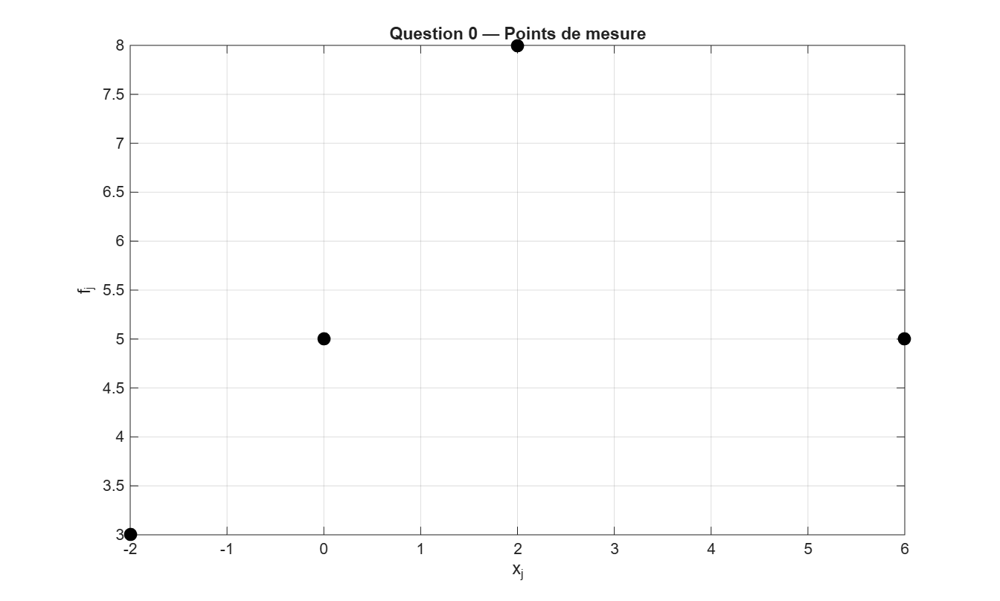
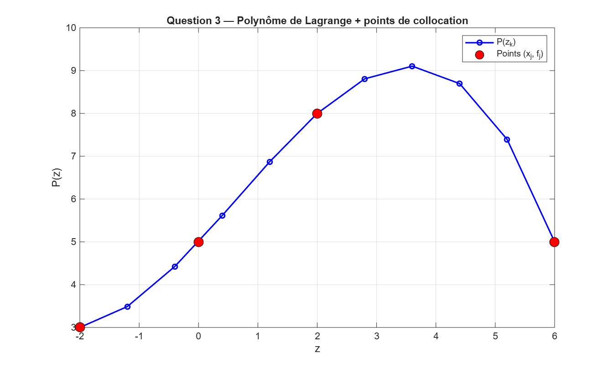
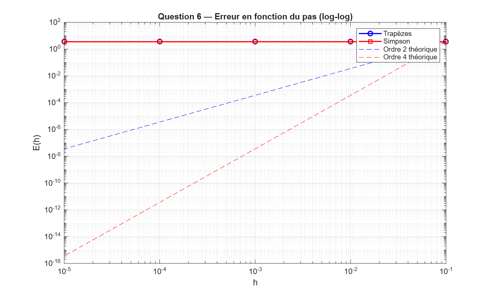

# TP — Interpolation de Lagrange et intégration numérique

## Contexte
TP réalisé en L2 double licence mathématiques-mécanique (Sorbonne Université).  
Objectif : approximation polynomiale d'une fonction f(z) sur [-2, 6] puis calcul numérique de l'intégrale du polynôme interpolé.

## Méthodes implémentées
- Interpolation polynomiale de Lagrange (2 boucles imbriquées)
- Construction point par point du polynôme sur m sous-intervalles
- Intégration numérique par la méthode composite des **trapèzes**
- Intégration numérique par la méthode composite de **Simpson**
- Étude de la convergence en échelle log-log pour h = 0.1, 0.01, 0.001, 0.0001, 0.00001

## Résultats

### Polynôme de Lagrange

### Convergence des méthodes d'intégration

| Méthode | Ordre théorique |
|---|---|
| Trapèzes composites | 2 |
| Simpson composite | 4 |

## Fichiers
- `ndiaye.m` — script principal MATLAB (questions 0 à 6)
- `donnees.dat` — points de collocation (xj, fj)
- `lagrange.dat` — valeurs du polynôme (zk, Pk)
- `erreur.dat` — erreurs en fonction du pas h

## Exécution
1. Ouvrir `ndiaye.m` dans MATLAB
2. Lancer le script (F5)
3. Les figures et fichiers `.dat` sont générés automatiquement

## Auteur
Ndiaye Moustapha — L2 Mathématiques-Mécanique, Sorbonne Université
